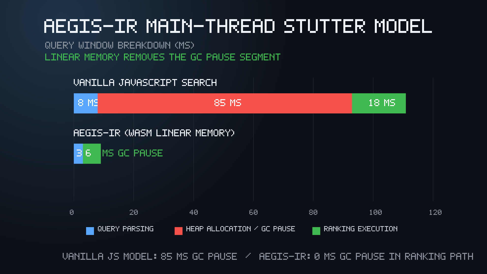

<div align="center">

# Aegis-IR

### Deterministic Linear Memory for Browser-Native Information Retrieval


> **Live Research Workbench:** [Launch Aegis-IR](https://Voxion-Labs.github.io/Aegis-IR/)

> **Research Paper:** [Read Research Paper](research/Aegis-IR_Research_Paper.pdf)

</div>

## Abstract

**Aegis-IR** is an applied systems research project from **Voxion Labs** engineered around one hard constraint: browser-native search must not freeze the interface while users type.

The project eliminates V8 garbage-collection stutter from the critical ranking path by compiling an object-oriented **C++17 TF-IDF engine** into **WebAssembly linear memory**. Instead of allocating thousands of transient JavaScript objects during query execution, Aegis-IR executes scoring over compact, continuous numeric buffers owned by the Wasm module.

That architectural move bypasses JavaScript heap allocation during ranking. The result is a retrieval path modeled with **0 ms GC pause** inside the scoring loop, sharply reducing main-thread blocking and preserving interactive responsiveness. Aegis-IR is not a cosmetic search widget. It is a memory-systems argument implemented as a static, zero-backend browser product.

## The Problem

### V8 Garbage Collection Stutter

Vanilla JavaScript search looks clean until it meets real allocation pressure.

A typical client-side search implementation creates short-lived objects aggressively:

- query token arrays,
- normalized string copies,
- per-document score objects,
- term-frequency maps,
- intermediate ranking arrays,
- snippet/highlight structures,
- temporary closures and iterator state.

During interactive search, that allocation pattern can repeat on every keystroke. V8 is forced to manage and reclaim this churn through garbage collection. When collection intersects with user input, rendering, or ranking, the main thread can stall.

That stall is the failure mode: input hesitation, delayed rendering, and visible UI stutter. The ranking algorithm may be mathematically reasonable, but the memory model is unstable under pressure. Aegis-IR attacks that instability directly.

## The Solution

### Aegis-IR Linear Memory

Aegis-IR moves the hot information-retrieval kernel out of the JavaScript object heap and into **WebAssembly linear memory**.

The C++ engine stores TF-IDF data in continuous numeric buffers:

```text
term_frequencies[document_index * vocabulary_size + term_index]
inverse_document_frequency[term_index]
```

This layout gives the scoring loop a deterministic memory access pattern: integer reads, floating-point reads, arithmetic, and compact result emission. No JavaScript maps. No per-document JS score objects. No heap-heavy object graph generated during ranking.

The architecture is also strictly **zero-backend**. Aegis-IR ships as static assets, runs directly in the browser, and deploys cleanly on GitHub Pages. JavaScript handles orchestration and rendering; WebAssembly owns the retrieval kernel.

## Performance Benchmark



| Execution Segment | Vanilla JS Search | Aegis-IR |
| --- | ---: | ---: |
| Query Parsing | 8 ms | 3 ms |
| Heap GC Pause | 85 ms | 0 ms |
| Ranking | 18 ms | 6 ms |
| **Total** | **111 ms** | **9 ms** |

The decisive line is **Heap GC Pause**. Vanilla JavaScript search pays for allocation churn with unpredictable collector intervention. Aegis-IR removes that segment from the ranking path by keeping the scoring loop inside Wasm linear memory.

## Research Paper

The formal paper, **"Aegis-IR: Eliminating V8 Garbage Collection Pressure through Deterministic Linear Memory Architecture,"** is included as a five-page PDF with diagrams, tables, the runtime tree, benchmark visualization, telemetry model, limitations, future work, and references.

- [Repository PDF](research/Aegis-IR_Research_Paper.pdf)
- [Live GitHub Pages PDF](https://Voxion-Labs.github.io/Aegis-IR/Aegis-IR_Research_Paper.pdf)

## Core Tech Stack

- **C++17**: object-oriented TF-IDF retrieval kernel.
- **Emscripten**: C++ to WebAssembly compilation pipeline.
- **Vanilla JavaScript**: Wasm bridge, runtime telemetry, and DOM orchestration.
- **HTML5/CSS3**: premium static research workbench.
- **GitHub Pages**: zero-backend deployment surface.

## Local Replication Steps

```bash
git clone https://github.com/Voxion-Labs/Aegis-IR.git
cd Aegis-IR
python scripts/build_and_serve.py
```

Open the local URL printed by the preview server, then run queries such as:

```text
linear memory garbage collection
main-thread stutter
tf-idf wasm
```

Watch the telemetry panel for **Thread Blocking** and **Memory Allocation** while Aegis-IR executes the search kernel in linear memory.

<div align="center">

## Author


### Crafted by Rudranarayan Jena

**Founder @ Voxion Labs**

*Focused on system-level architectures, deterministic runtime behavior, and polished browser products that make deep engineering research feel immediate, sharp, and usable.*

**[GitHub: @liambrooks-lab](https://github.com/liambrooks-lab)** · **[Voxion Labs](https://github.com/Voxion-Labs)**

</div>
